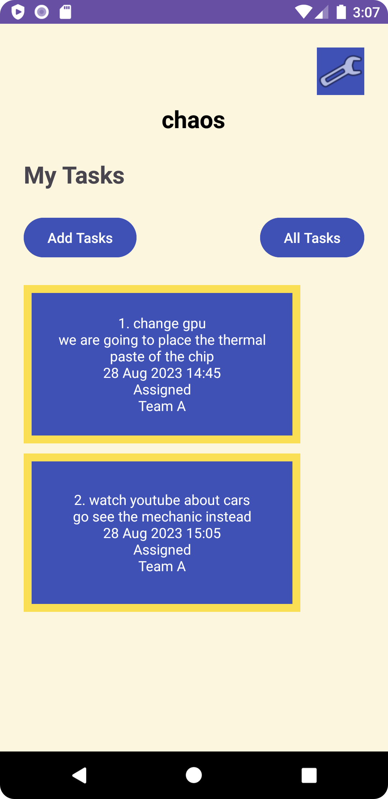
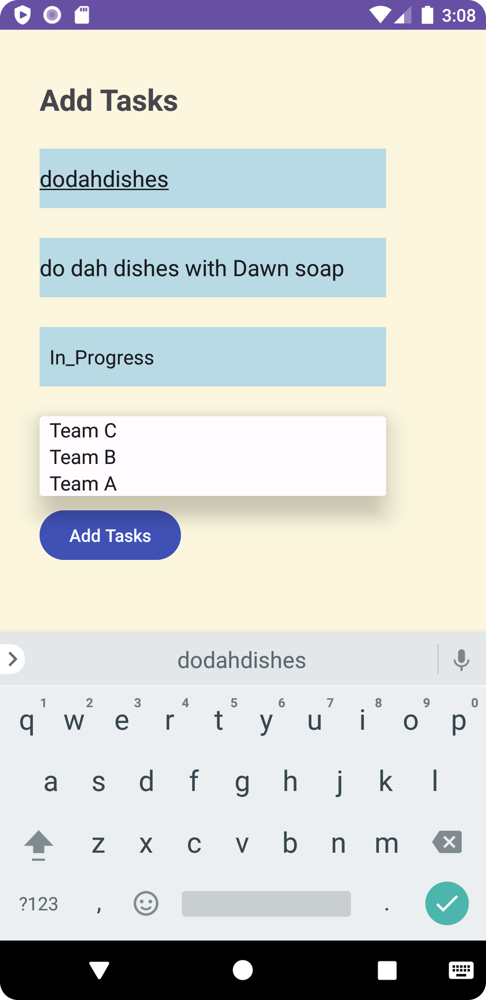

Welcome to the Task Manager Android application! This user-friendly application allows you to manage and view tasks seamlessly. Let's dive into its features and documentation.

## Table of Contents
- [Features](#features)
- [Screenshots](#screenshots)
- [How to Use](#how-to-use)
- [Daily Changes](#daily-changes)

## Features

### Feature Tasks for 2023/08/24

- **Tasks Are Cloudy**
    - Using the `amplify add api` command, establish a Task resource that mirrors our existing Task schema. Update all references to the Task data to use AWS Amplify for accessing your data in DynamoDB.

- **Add Task Form**
    - Revamp your Add Task form to commit the entered data as a Task to DynamoDB.

- **Homepage**
    - Refactor your homepage’s RecyclerView to present all Task entities stored in DynamoDB.

### 1. **Task Model with DynamoDB and Amplify**
- Core data structure for the app, now backed by AWS DynamoDB using Amplify.
    - **Title**: Descriptive title for the task.
    - **Body**: Detailed information about the task.
    - **State**: Task's current state which can be one of the following, although the task type selection is not yet functional:
        - New
        - Assigned
        - In Progress
        - Complete

### 2. **Homepage**
- Reconstructed based on an improved wireframe.
    - Implements a RecyclerView that showcases all Task entities from the local database.
    - Clicking on a Task in the RecyclerView launches its detail page with appropriate data.
    - Other Features:
        - Heading at the top.
        - Mock image of "my tasks" view.
        - Button to access the **Settings** page.
            - After inputting username in settings, it displays “{username}” above the task buttons.
        - Navigation buttons:
            - **Add Tasks**: Directs to the "Add a Task" page.
            - **All Tasks**: Leads to the "All Tasks" page.

### 3. **Add Task Form**
- A form to create new tasks, though it's not fully functional yet.
    - Input fields:
        - **Title**
        - **Body**
    - "Submit" button currently shows "submitted!" upon pressing, without storing data into the database.

### 4. **Task Detail Page**
- Detailed view of a specific task.
    - Displays both task title and description.
    - Previously, used Lorem Ipsum for the task's description.

### 5. **Settings Page**
- Allows users to personalize their app experience.
    - Input field to enter username.
    - "Save" button to store the username.

### 6. **All Tasks**
- Still displays a placeholder image.
    - Use the phone's back button to return.

## Screenshots

## How to Use

1. **Launching the Application**
    - Initiate the app to view the homepage.

2. **Adding a Task**
    - From the homepage, navigate to "Add a Task".
    - Fill in the task details and click submit.

3. **Viewing a Task Detail**
    - From the homepage, select a task title from the RecyclerView.
    - The detail page of that specific task will appear.

4. **Personalizing with Settings**
    - Click on the settings icon from the homepage.
    - Enter your username and save.

5. **Browsing All Tasks**
    - Select "All Tasks" from the homepage.
    - This currently displays a placeholder image.

## Daily Changes

2023/08/24
- Fully integrated AWS Amplify and transitioned from Room to DynamoDB.
- Modified the **Add Task Form** to store tasks directly in DynamoDB.
- Overhauled the **Homepage** to use RecyclerView that fetches tasks from DynamoDB.
- Documentation updates to integrate today's feature tasks and revisions in the daily changes section.

2023/08/17
- Rolled out the **Task Model** integrated with Room for structured data storage.
- Modernized the **Homepage** to utilize RecyclerView, showcasing tasks directly from the database.
- The **Add Task Form** was enhanced to capture and store tasks in the local database.
- **Task Detail Page** now displays both title and description of tasks.
- Documentation received further updates to include the recent feature tasks and to refresh the daily changes log.

2023/08/16
- Introduced the **Task Model** for structured data handling.
- Refactored the **Homepage** to incorporate RecyclerView for displaying tasks. Added hardcoded Task data.
- Enhanced **Documentation**: Added new feature tasks and updated the daily changes section.

2023/08/15
- Updated the **Homepage** with new button functionalities and UI adjustments.
- Introduced the **Task Detail Page**.
- Designed the **Settings Page** for personalized experience, changing your user nickname.
- Enhanced **Documentation**: Replaced homepage screenshot and added a screenshot of the Task Detail page.

---

[//]: # (The how to was generated by ChatGPT)
We hope this README provides a clear understanding of the application's features and functionality. Feel free to reach out with any feedback or suggestions!
