# TaskMaster

Welcome to the Task Manager Android application! This user-friendly application allows you to manage and view tasks seamlessly. Let's dive into its features and documentation.

## Table of Contents
1. [Features](#features)
2. [Screenshots](#screenshots)
3. [Installation](#installation)
4. [How to Use](#how-to-use)
5. [Technologies Used](#technologies-used)
6. [Daily Changes](#daily-changes)

## Features

### Feature Tasks for 2023/09/03

- **S3 Integration with TaskMaster**
    - Integrated Amazon S3 with the TaskMaster app for enhanced media storage capabilities.
    - Users can now attach images or documents to their tasks, providing a richer description and context.

- **Image Upload Feature in Add Task Form**
    - Enhanced the "Add Task Form" to include an option to upload images directly.
    - Images uploaded are securely stored in an S3 bucket and can be referenced and displayed within the app.

- **Task Detail Page Media Display**
    - The Task Detail Page has been revamped to not only display the task's title and body but also any associated images or documents.
    - Thumbnails of uploaded images are shown, which users can tap to view in full-screen mode.

- **Backend Optimizations for Media Handling**
    - Introduced efficient and secure media handling practices to ensure that user uploads are processed quickly and securely.
    - Added error handling mechanisms to gracefully handle scenarios where media uploads might fail, giving users appropriate feedback.

- **Cache Mechanism for Faster Media Retrieval**
    - Implemented a caching mechanism to ensure frequently accessed images are loaded faster on subsequent views.
    - This significantly improves the user experience, especially when viewing tasks with high-resolution images.

### 1. **Task Model with DynamoDB and Amplify**
- Core data structure for the app, now backed by AWS DynamoDB using Amplify.
    - **Title**: Descriptive title for the task.
    - **Body**: Detailed information about the task.
    - **State**: Task's current state which can be one of the following, although the task type selection is not yet functional:
        - New
        - Assigned
        - In Progress
        - Complete

### 2. **Homepage**
- Reconstructed based on an improved wireframe.
    - Implements a RecyclerView that showcases all Task entities from DynamoDB.
    - Now filters tasks based on the team selected in settings.
    - Clicking on a Task in the RecyclerView launches its detail page with appropriate data.
    - Other Features:
        - Heading at the top.
        - Mock image of "my tasks" view.
        - Button to access the **Settings** page.
            - After inputting username in settings, it displays “{username}” above the task buttons.
        - Navigation buttons:
            - **Add Tasks**: Directs to the "Add a Task" page.
            - **All Tasks**: Leads to the "All Tasks" page.

### 3. **Add Task Form**
- A form to create new tasks, though it's not fully functional yet.
    - Input fields:
        - **Title**
        - **Body**
    - "Submit" button currently shows "submitted!" upon pressing, without storing data into the database.

### 4. **Task Detail Page**
- Detailed view of a specific task.
    - Displays both task title and description.
    - Previously, used Lorem Ipsum for the task's description.

### 5. **Settings Page**
- Allows users to personalize their app experience.
    - Input field to enter username.
    - "Save" button to store the username.

### 6. **All Tasks**
- Still displays a placeholder image.
    - Use the phone's back button to return.

## Screenshots

### Home Screen
- **With Login**
  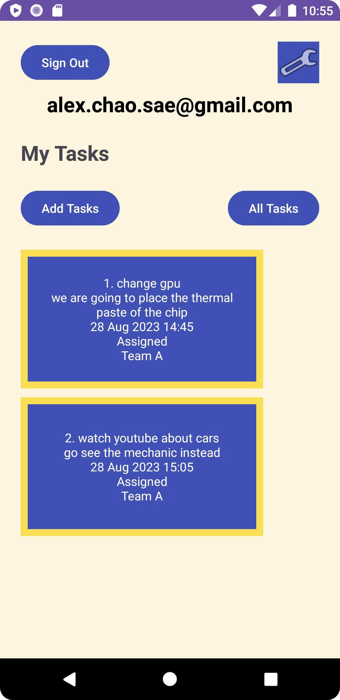
- **Without Login**
  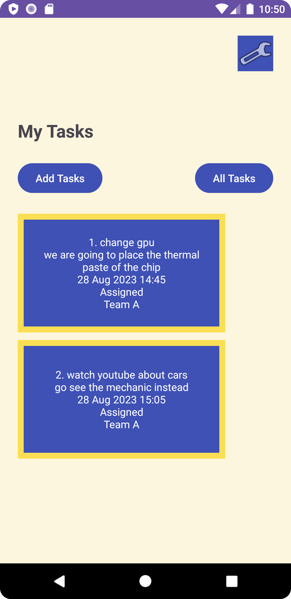

### Signup Page
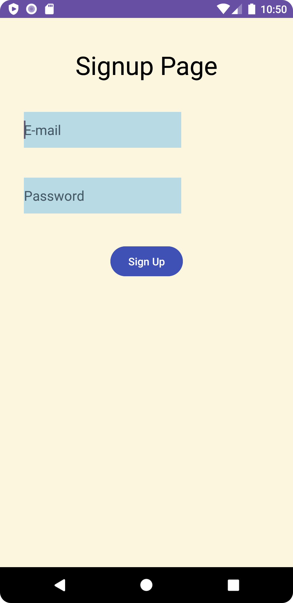

### Verification Page
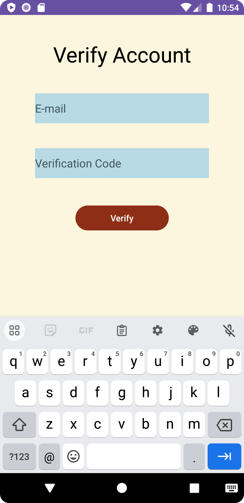

### Login Page
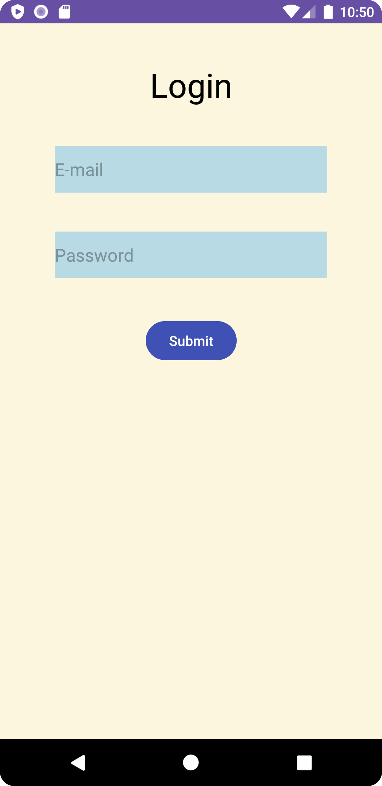

### Settings Page
- **With Login**
  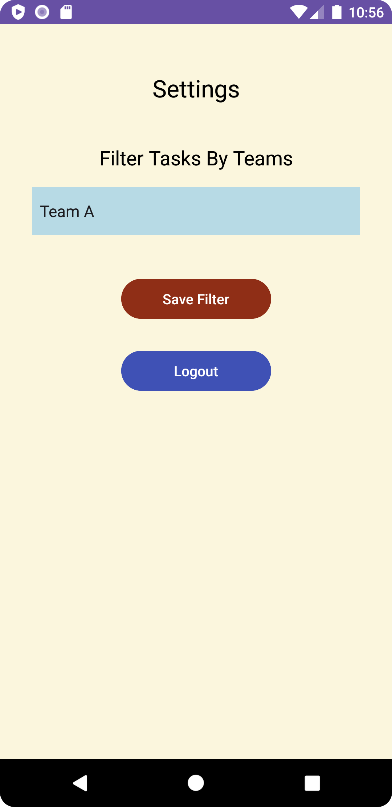
- **Without Login**
  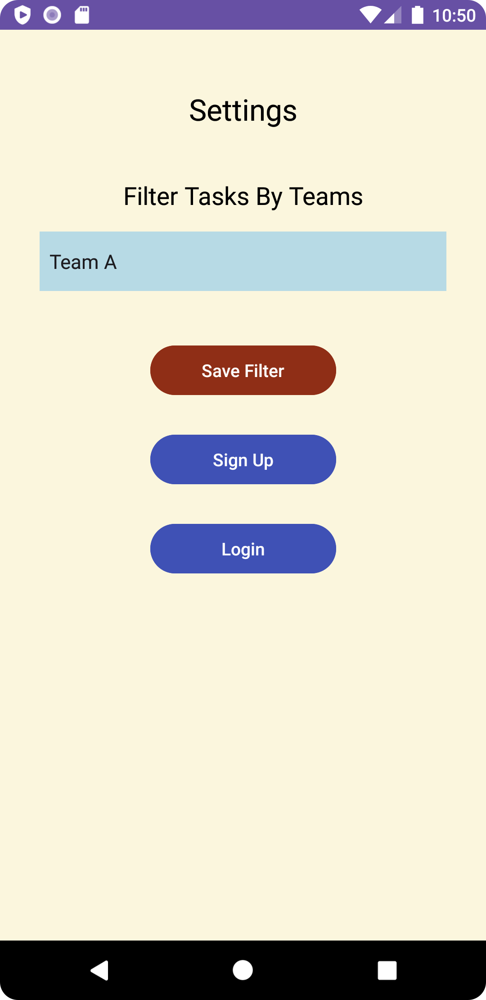

### Other Screenshots

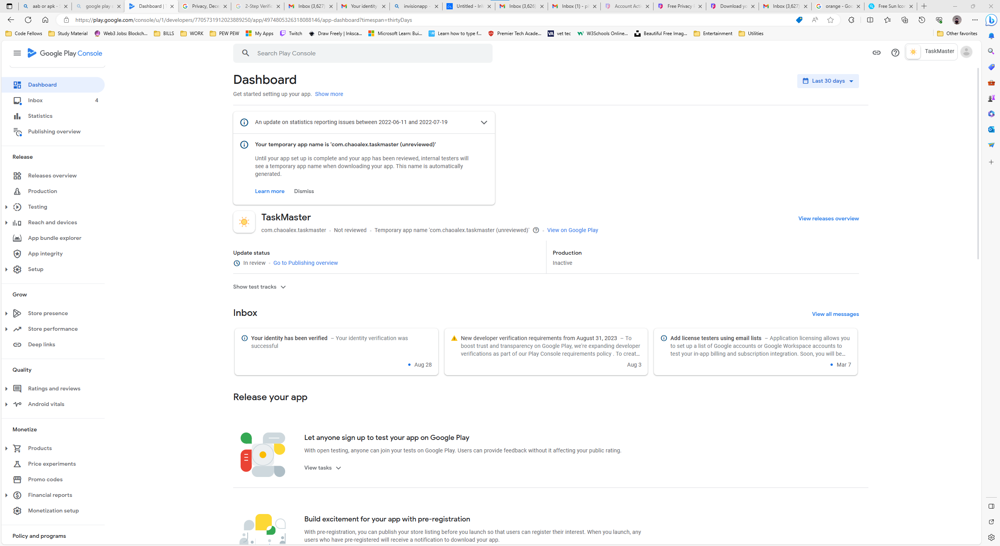

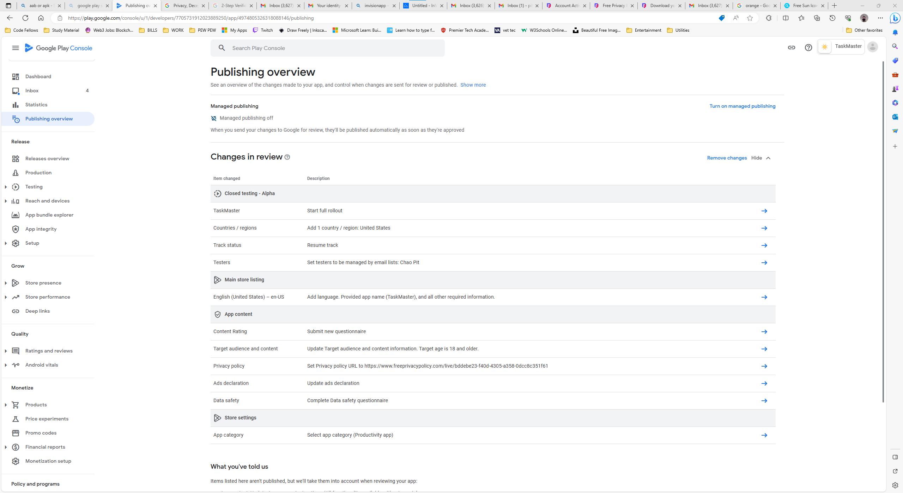

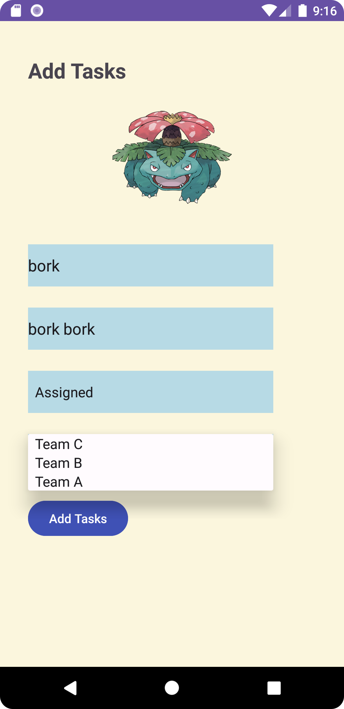

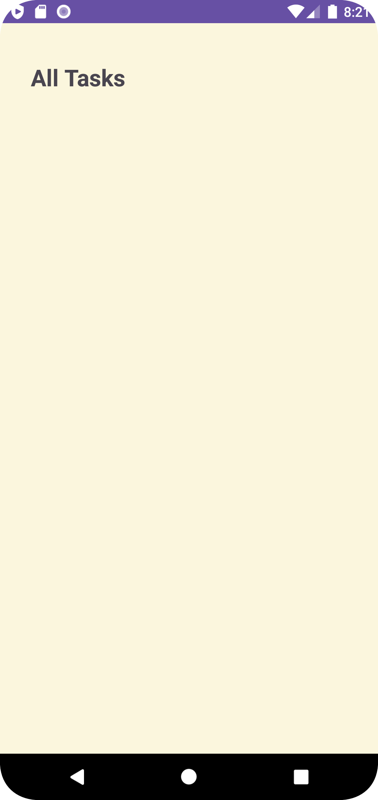

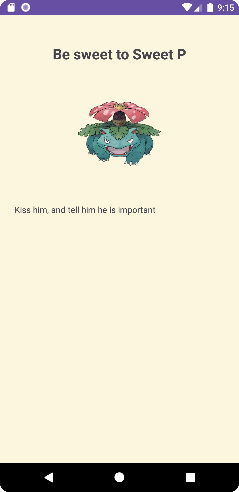

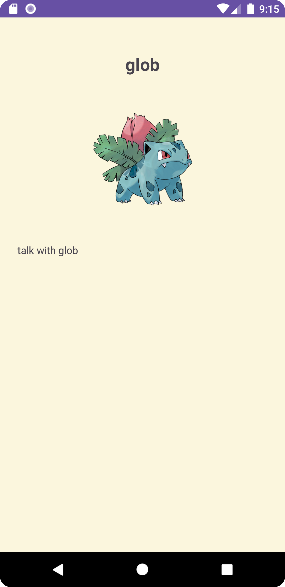

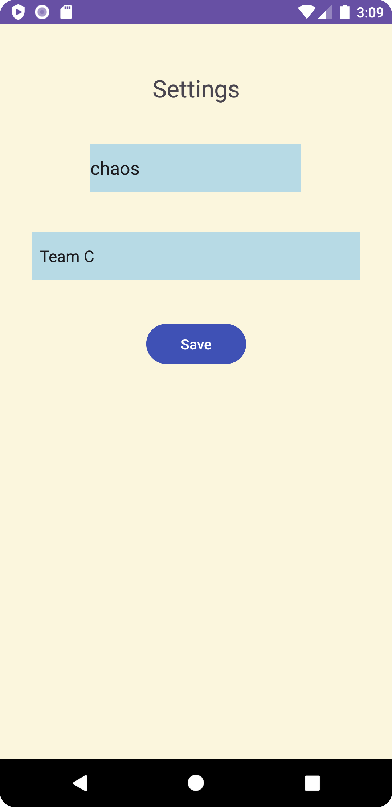

## Installation

1. **Google Play Store**
    - Google Play Store link to be provided soon!

2. **Manual Installation**
    - Download the APK file.
    - Follow the installation prompts.

## How to Use

### Starting Up

1. **Launching the Application**
    - Initiate the app to view the homepage.

### User Authentication

2. **User Signup**
    - If not already a registered user, navigate to the Signup page from the settings.
    - Fill in your username and password, and then click the "Submit" button.
    - You will receive a verification code via email.

3. **Verification**
    - After signing up, you'll be directed to the Verification page.
    - Enter the verification code that was sent to your email.
    - Click the "Verify" button.

4. **User Login**
    - If already a registered user, navigate to the Login page.
    - Enter your username and password, and then click the "Submit" button.
    - Upon successful login, you'll be redirected to the homepage.

### Task Management

5. **Adding a Task**
    - From the homepage, navigate to "Add a Task".
    - Fill in the task details and click submit.

6. **Viewing a Task Detail**
    - From the homepage, select a task title from the RecyclerView.
    - The detail page of that specific task will appear.

### Personalization

7. **Personalizing with Settings**
    - Click on the settings icon from the homepage.
    - If logged in, you'll see additional options.
    - Enter your username and save.

8. **Logout**
    - You can log out from the settings page or the main activity page by clicking the "Logout" button. After logging out, you will see the login button again.

### Browsing All Tasks

9. **Browsing All Tasks**
    - Select "All Tasks" from the homepage.
    - This currently displays a placeholder image.

## Technologies Used

- Java for Android Development
- AWS Amplify & DynamoDB for backend services
- Android Studio for IDE
- RecyclerView for list management

## Daily Changes

2023/08/30
- Completed a comprehensive manual walk through for Cognito Signup/Verify/Login/Logout flow.
- Created distinct Activities for user Signup, Verification, and Login.
- Updated Main Activity to handle Login/Logout dynamically based on user's authentication state.

2023/08/28
- App was introduced to the Google Play Store!
- Introduced Teams as entities owned by tasks.
- Enhanced **Add Task Form** to include team selection.
- Updated **Settings Page** to include team selection, which filters tasks displayed on the Homepage.

2023/08/24
- Fully integrated AWS Amplify and transitioned from Room to DynamoDB.
- Modified the **Add Task Form** to store tasks directly in DynamoDB.
- Overhauled the **Homepage** to use RecyclerView that fetches tasks from DynamoDB.
- Documentation updates to integrate today's feature tasks and revisions in the daily changes section.

2023/08/17
- Rolled out the **Task Model** integrated with Room for structured data storage.
- Modernized the **Homepage** to utilize RecyclerView, showcasing tasks directly from the database.
- The **Add Task Form** was enhanced to capture and store tasks in the local database.
- **Task Detail Page** now displays both title and description of tasks.
- Documentation received further updates to include the recent feature tasks and to refresh the daily changes log.

2023/08/16
- Introduced the **Task Model** for structured data handling.
- Refactored the **Homepage** to incorporate RecyclerView for displaying tasks. Added hardcoded Task data.
- Enhanced **Documentation**: Added new feature tasks and updated the daily changes section.

2023/08/15
- Updated the **Homepage** with new button functionalities and UI adjustments.
- Introduced the **Task Detail Page**.
- Designed the **Settings Page** for personalized experience, changing your user nickname.
- Enhanced **Documentation**: Replaced homepage screenshot and added a screenshot of the Task Detail page.

---

[//]: # (The how to was generated by ChatGPT)
We hope this README provides a clear understanding of the application's features and functionality. Feel free to reach out with any feedback or suggestions!
