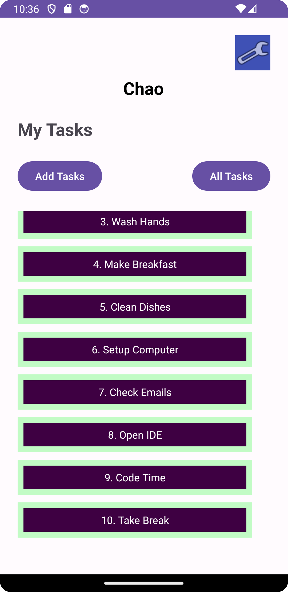
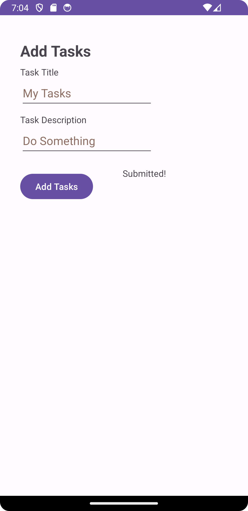
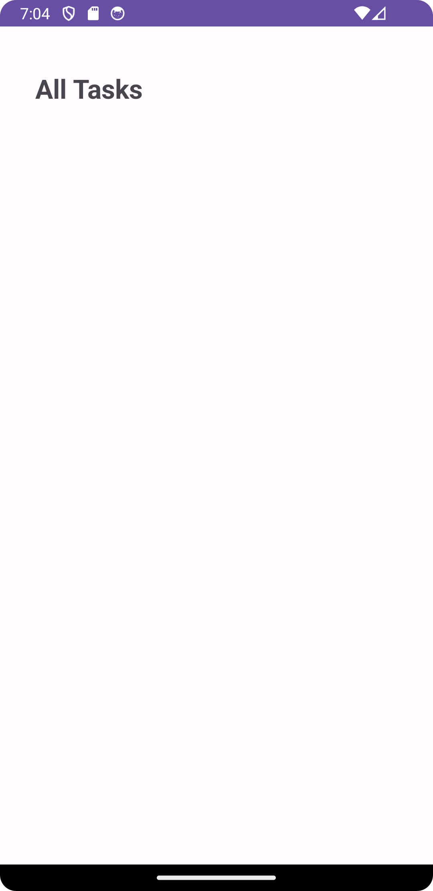
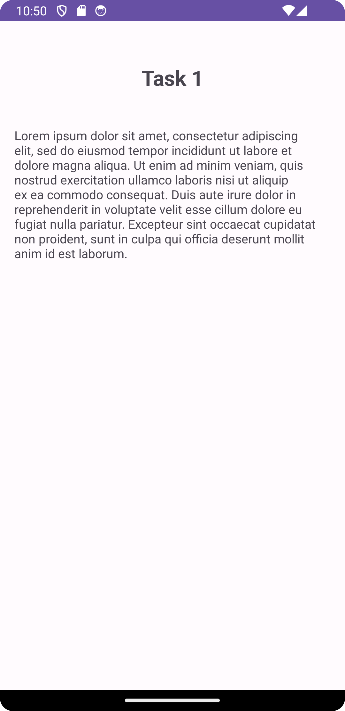

# Android Application: Task Manager

Welcome to the Task Manager Android application! This user-friendly application allows you to manage and view tasks seamlessly. Let's dive into its features and documentation.

## Table of Contents
- [Features](#features)
- [Screenshots](#screenshots)
- [How to Use](#how-to-use)
- [Daily Changes](#daily-changes)

## Features

### 1. **Homepage**
- Built based on a specific wireframe.
    - Heading at the top.
    - Mock image of "my tasks" view.
    - Three hardcoded task titles as buttons.
        - Tapping a title navigates to the corresponding Task Detail page.
    - A button to access the **Settings** page.
        - After inputting username in settings, displays “{username}” above the task buttons.
    - Navigation buttons:
        - **Add Tasks**: Takes you to the "Add a Task" page.
        - **All Tasks**: Takes you to the "All Tasks" page.

### 2. **Add a Task**
- Designed for adding new tasks.
    - Input fields:
        - **Title**: Task's title.
        - **Body**: Detailed description.
    - "Submit" button:
        - On submission, shows "submitted!" without saving data at this point.

### 3. **Task Detail Page**
- Displays detailed information about a task.
    - Task title at the top.
    - Lorem Ipsum text as task description.

### 4. **Settings Page**
- Personalize the app experience.
    - Input field for username.
    - "Save" button to confirm username.

### 5. **All Tasks**
- Currently a placeholder image.
    - For navigating back, use the phone's back button.

## Screenshots

## How to Use

1. **Launching the Application**
    - Initiate the application to see the homepage.

2. **Adding a Task**
    - From the homepage, access "Add a Task".
    - Input task details and press submit.

3. **Viewing a Task Detail**
    - On the homepage, tap on a task title.
    - It will show the detail of that specific task.

4. **Personalizing with Settings**
    - Use the settings button on the homepage.
    - Input your username and save.

5. **Browsing All Tasks**
    - Tap "All Tasks" on the homepage.
    - It's a placeholder image for now.

## Daily Changes
- Updated the **Homepage** with new button functionalities and UI adjustments.
- Introduced the **Task Detail Page**.
- Designed the **Settings Page** for personalized experience, changing your user nickname.
- Enhanced **Documentation**: Replaced homepage screenshot and added a screenshot of the Task Detail page.

---

[//]: # (The how to was generated by ChatGPT)
We hope this README provides a clear understanding of the application's features and functionality. Feel free to reach out with any feedback or suggestions!
